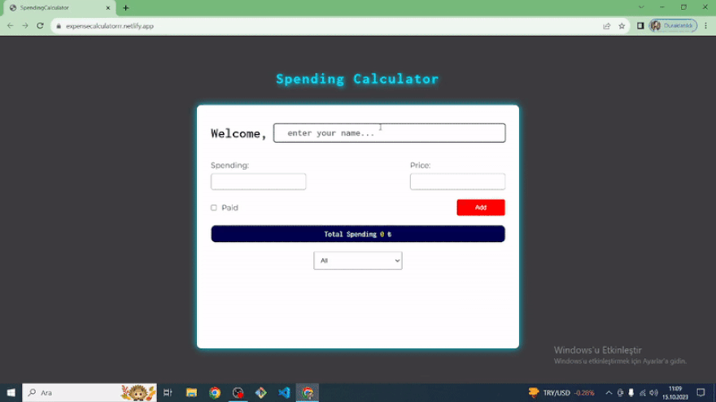

# Spending Calculator

# To Do List
- Adding spending cards
- - When click #add-btn button, get the inputs data
- - If inputs are empty, pages gives error
- - If inputs are not empty put on the screen spending card
- - When the checkbox input checked, page should "paid" class to list item.
- - Page should delete all info that user gave, after user add button.
    (inputs must be empty string and checkbox must be unchecked)

- Total Spending
- - We must create total spending area in HTML, and we must create variables that named total in JS.
- - Each time a new expense is added, add that amount to the "total" variable
    Each time a new expense is deleted, subtract that amount from the "total" variable
- - Each time, when the "total" is uptated, also update the price information on the screen 

- Deleting | Updating function
- - Listedeki bütün tıklanma olaylarını izle
- - Track all click events in the list
- - If the id of the clicked item is updated, add or remove the "paid" class
*For elements that we send with js rather than writing directly in HTML, we add the event tracker to the parent element of that element, not directly to that element. (The container for the trash photos we use for "delete" in our project is the list element. Therefore, we will add click, which is the addEventListener/click, to it.)

- Filtering spendings
- - Create Select area at HTML.
- - Every time select changes, get the choosen info.
- - After that, make filter according to choosen value.

<!DOCTYPE html>
<html lang="en">
<head>
    <meta charset="UTF-8">
</head>
<body>
    
  
Coded as a expense calculator. Calculator can also use small screen.

<h2 id="built-with">Built With</h2>
  <ul>
    <li>HTML</li>
    <li>CSS</li>
    <li>JAVASCRIPT</li>
  </ul>

You can reach to Website, when you are click <a href="https://expensecalculatorrr.netlify.app/">HERE</a>.

</body>
</html>

Screenshot 
